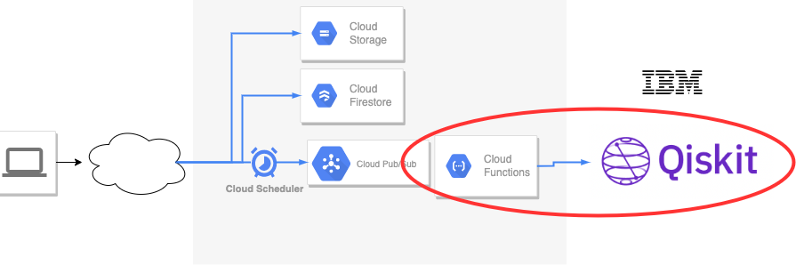
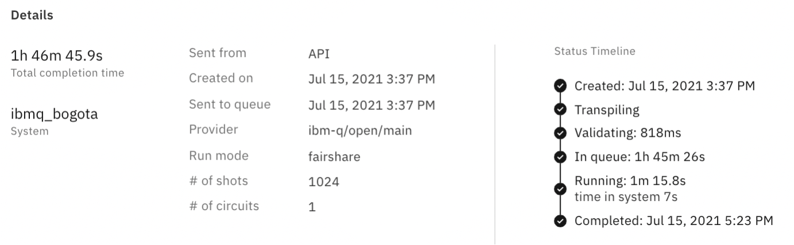

# qiskit-cloud-functions

Using Cloud Functions and Qiskit to obtain random numbers from IBMQ.
This project is used in [HaiQ](https://www.haiq.app/).
The part circled in red corresponds to this project.

## Problems in developing web applications with quantum computers

The following could take nearly 2 hours when throwing a job to a quantum computer.
This will degrade the UX of the web application.

## Solution

In order to process quantum computers on the cloud, we implemented the function in the following three parts, considering the length of processing time of a Job and the capacity of Cloud Functions.

1. Throw a job(quantum circuit)
2. Obtain the execution status of the job using job_monitor prepared in Qiskit, and obtain a set of random numbers.
3. Generate contents

### About HaiQ

HaiQ is a platform where a quantum computer generates haiku from current popular words and issues them to your Wallet as NFTs for free.
The document of how to play is [here](https://medium.com/@HaiQ/how-to-claim-haiq-nft-4915a39028ae).
